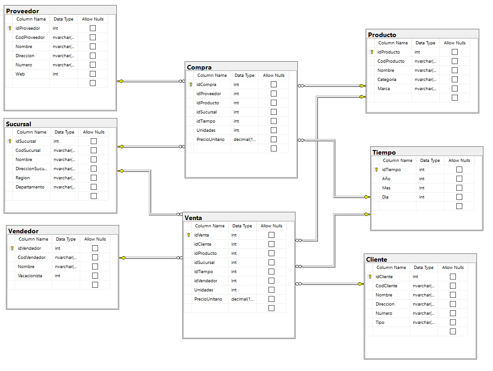
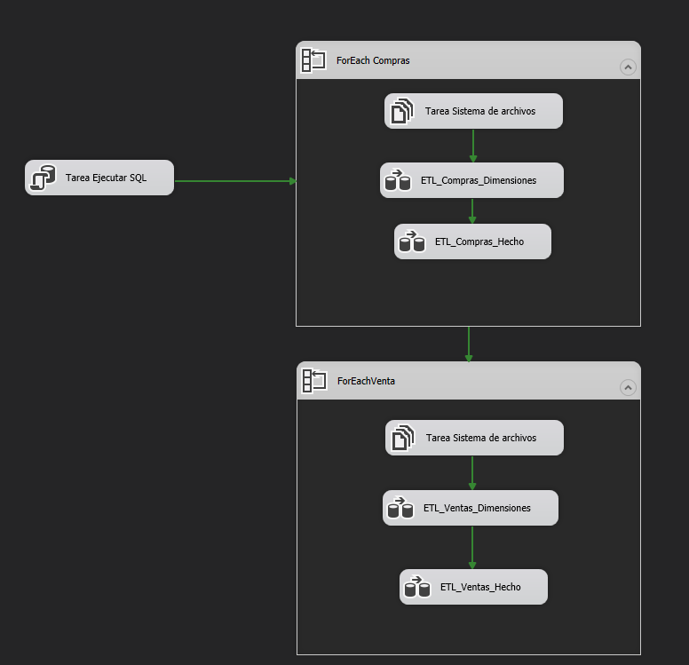
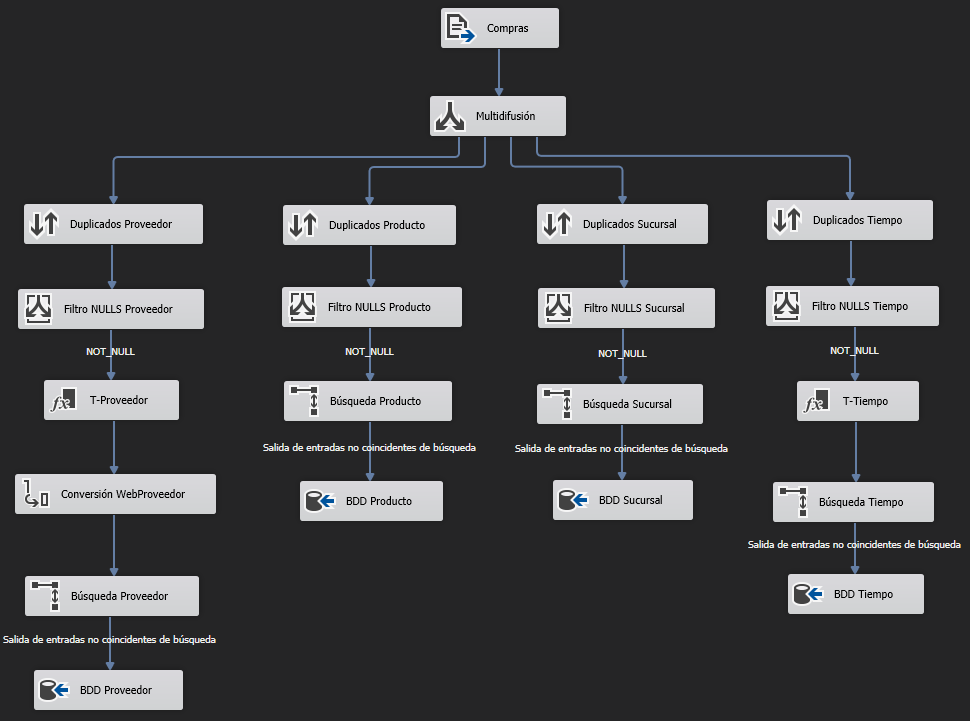
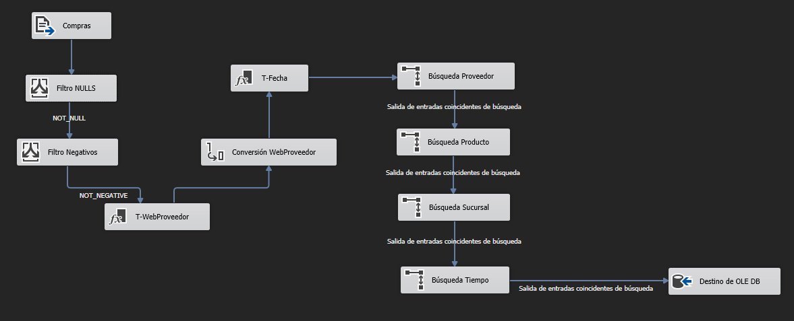
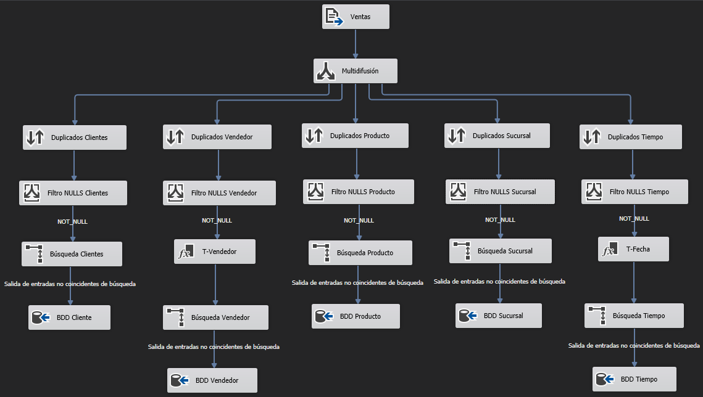
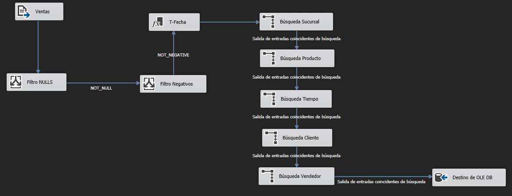

# OneSolution - BI
OneSolution es una cadena de tiendas por departamentos que vende tanto al público en general (por menor) como a clientes mayoristas. Se inició como un negocio pequeño, pero debido al auge que ha tenido la industria alimentaria en esta crisis ocasionada por la pandemia, las ventas y compras han aumentado en gran manera.

El proyecto OneSolution-BI, consiste en proveer una solución que resuelva los problemas anteriormente planteados, esto como fin principal para la generación de reportes sobre las compras y las ventas de la empresa con la facilidad de generar estos en intervalos de tiempo según sean las necesidades que se presenten.

## Modelo Dimensional - Constelacion

  

Se implemento un modelo dimensional tipo constelacion ya que contamos con dos hechos (Ventas y Compras) para el analisis, y estos comparten la mitad de las dimensiones que son Sucursal,Tiempo y Producto

## Proceso ETL

  

El flujo de control (principal) controla todo nuestro ETL, consiste basicamente en 

- Vaciado de la base de datos
- Iteracion de Archivos .cp, en cada iteracion se realiza lo siguiente
    - Creacion de Dimensiones Proveedor,Producto,Sucursal,Tiempo
    - Creacion de Hecho Compras 

- Iteracion de Archivos .vt, en cada iteracion se realiza lo siguiente
    - Creacion de Dimensiones Clientes,Vendedor,Producto,Sucursal,Tiempo
    - Creacion de Hecho Ventas

## Creacion de Dimensiones - Compras

  

En este flujo se hace una multidifusion para la creacion de las dimensiones por separado
para cada sub-flujo se hace lo siguiente
- Se eliminan duplicados y se quitan columnas sin relacion a la dimension
- Se filtran las tuplas con campos vacios
- Se filtran las tuplas ya existentes en la base de datos
- Se inserta a la base de datos

Adicionalmente 
- Para el sub-flujo de la dimension Proveedor se transforma el campo WebProveedor de string a integer
- Para el sub-flujo de la dimension Tiempo se separa el campo Fecha en los campos Año,Mes,Dia

## Creacion de Hecho - Compra

  

Este flujo consiste en
- Filtrar tuplas con numero negativos o campos vacios
- Se hacen las transformaciones anteriores de las dimensiones Proveedor y Tiempo
- Se busca la llave subrogada de cada dimension
- Se inserta a la base de datos

## Creacion de Dimensiones - Ventas

  

En este flujo se hace una multidifusion para la creacion de las dimensiones por separado
para cada sub-flujo se hace lo siguiente
- Se eliminan duplicados y se quitan columnas sin relacion a la dimension
- Se filtran las tuplas con campos vacios
- Se filtran las tuplas ya existentes en la base de datos
- Se inserta a la base de datos

Adicionalmente 
- Para el sub-flujo de la dimension Vendedor se transforma el campo Vacacionista de string a integer
- Para el sub-flujo de la dimension Tiempo se separa el campo Fecha en los campos Año,Mes,Dia

## Creacion de Hecho - Ventas

  

Este flujo consiste en
- Filtrar tuplas con numero negativos o campos vacios
- Se hacen las transformaciones anteriores de dimension Tiempo
- Se busca la llave subrogada de cada dimension
- Se inserta a la base de datos
